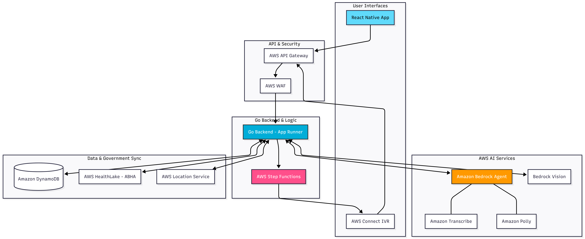

# Design Document: Bhasha-Med AI 🧠

## 1. System Design Architecture
Bhasha AI utilizes a **Decoupled Microservices Architecture** written in **Golang** for high-performance concurrency and low-latency execution.

* **API Gateway:** Entry point for traffic management, throttling, and AWS WAF integration.
* **Service Layer (Go):** Handles business logic, session management, and asynchronous handshakes.
* **Orchestration:** **AWS Step Functions** manage the state of long-running "Agentic" tasks to ensure reliability through retries.




---

## 2. Technical Decisions: The "Why"

### **Backend: Golang**
* **Why:** Superior handling of high-concurrency audio streams via Goroutines compared to Python/Node.js.
* **Impact:** Reduced memory footprint allows for higher throughput on a smaller **AWS App Runner** instance.

### **Intelligence: Amazon Bedrock (Claude 3.5)**
* **Why:** Largest context window and high reasoning capability for complex medical triage and vision-based prescription OCR.
* **Impact:** Enables the app to act as an "Agent" rather than a simple chatbot.

### **Connectivity: Amazon Connect & Step Functions**
* **Why:** Bridging the digital-to-physical gap. Connect provides the telephony interface, while Step Functions ensures the booking logic doesn't fail during network drops.
* **Impact:** Real-world utility in booking appointments at local clinics.

---

## 3. Agentic Workflow Logic
The core novelty is the **Autonomous Booking Agent**. 

1. **Extraction:** Bedrock identifies intent and parameters (Doctor, Time, Patient ID).
2. **Execution:** Step Functions triggers an outbound call via **Amazon Connect**.
3. **Synthesis:** **Amazon Polly** narrates the triage summary to the human receptionist.
4. **Closing:** The agent confirms the slot and writes the record to **DynamoDB**.

### **Performance Specifications**
* **Concurrent Sessions**: 10,000+ simultaneous voice streams via Go routines
* **Response Time**: <2 seconds for triage analysis, <5 seconds for booking confirmation
* **Throughput**: 50,000 requests per minute during peak hours
* **Memory Footprint**: <512MB per App Runner instance


---

## 4. Security & Compliance
* **Data Privacy:** Using **AWS HealthLake** to maintain FHIR-compliant data structures for ABHA synchronization.
* **Encryption:** AES-256 encryption at rest (KMS) for PII (Personally Identifiable Information).
* **Identity:** OIDC-based authentication via **Amazon Cognito** to link user accounts with government health IDs.

---

## 5. UI/UX Strategy for Accessibility
* **Voice-First Design:** Direct audio-to-triage pipeline using **Amazon Transcribe**.
* **Zero-Nav UI:** Centralized microphone interface to minimize cognitive load for low-literacy users.
* **Haptic Feedback:** Physical vibration cues for interaction confirmation.


---

## 6. API Specifications & Data Flow

### **Core API Endpoints**
```go
// Voice Triage API
POST /api/v1/triage
Content-Type: audio/wav
Response: {
  "severity": "high|medium|low",
  "recommendations": ["clinic_ids"],
  "next_steps": "voice_guidance_text"
}

// Autonomous Booking API  
POST /api/v1/book-appointment
{
  "patient_id": "string",
  "clinic_id": "string", 
  "preferred_time": "datetime",
  "symptoms_summary": "string"
}

// Prescription OCR API
POST /api/v1/prescription/scan
Content-Type: image/jpeg
Response: {
  "medications": [{"name": "string", "dosage": "1-0-1", "timing": "after_food"}],
  "reminders_set": true
}
```

### **Data Models (DynamoDB)**
```go
type PatientSession struct {
    SessionID     string    `json:"session_id"`
    PatientID     string    `json:"patient_id"`
    Timestamp     time.Time `json:"timestamp"`
    AudioDuration int       `json:"audio_duration_sec"`
    TriageResult  string    `json:"triage_result"`
    CostIncurred  float64   `json:"cost_incurred"`
}

type AppointmentRecord struct {
    AppointmentID string    `json:"appointment_id"`
    PatientID     string    `json:"patient_id"`
    ClinicID      string    `json:"clinic_id"`
    BookedAt      time.Time `json:"booked_at"`
    Status        string    `json:"status"` // confirmed, pending, cancelled
}
```

---

## 7. Error Handling & Resilience

### **Failure Scenarios & Recovery**
* **Network Drops**: Step Functions retry logic with exponential backoff
* **Transcription Errors**: Fallback to simplified Hindi/English prompts
* **Booking Failures**: Queue system with manual clinic callback within 2 hours
* **High Load**: Auto-scaling triggers at 80% CPU, circuit breaker at 95%

### **Monitoring & Alerting**
* **CloudWatch Metrics**: Session success rate, average response time, cost per session
* **Custom Dashboards**: Real-time user geography, language distribution, peak usage
* **Alerts**: >5% error rate, >3 second response time, >$0.05 per session cost

---

## 8. Deployment Strategy & Development Phases

### **First Prototype (2 weeks)**
1. **Voice Triage System**: Multi-language symptom analysis (Hindi, English + 2 regional languages)
2. **Clinic Integration**: Real-time clinic finder with 25+ healthcare providers
3. **Autonomous Booking**: Live appointment scheduling with actual clinic calls
4. **Mobile App**: Full React Native application with voice-first interface
5. **Prescription Scanner**: Basic OCR for medication extraction and reminders


### **Competitive Differentiation**
* **vs. Practo/1mg**: Voice-first for low-literacy users, autonomous booking
* **vs. Government Apps**: Multi-dialect support
* **vs. Telemedicine**: Physical appointment facilitation, not just consultation